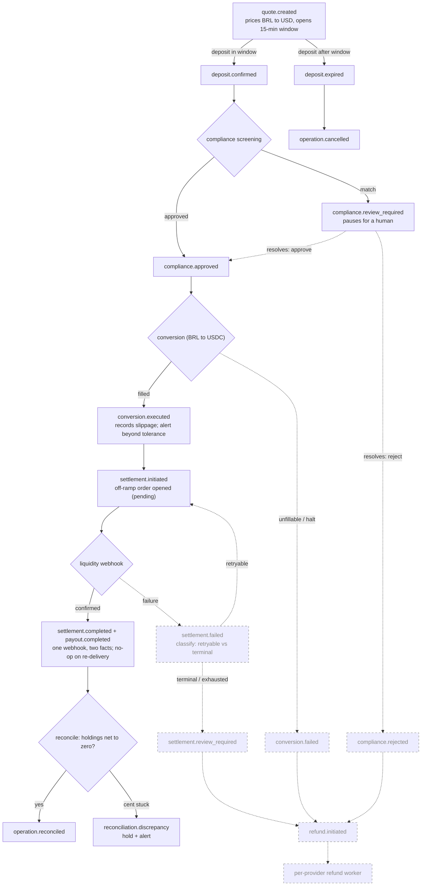
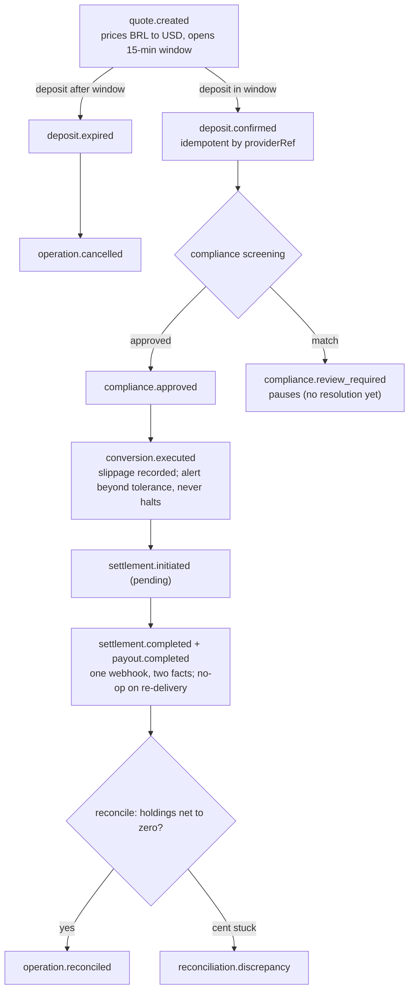

# 💱 FX Remittance Ledger

> An event-sourced vertical slice of an FX remittance pipeline (BRL → USD over crypto rails), built as a take-home. The system doesn't perform the exchange itself — it **orchestrates** providers and guarantees no cent is lost and every step is auditable.

## 📋 Overview

The unit of work is a single **`FxOperation`** — an event-sourced aggregate that moves through six asynchronous steps, each emitting one immutable, past-tense fact:

**quote → deposit → compliance → conversion → settlement → payout → reconciled.**

The engineering lives in the **deviations**, not the happy path: a deposit after the quote window (`deposit.expired → operation.cancelled`), conversion slippage beyond tolerance (recorded as a durable fact, *not* halted — the customer still gets the locked quote), a re-delivered webhook that becomes a no-op instead of a double payout, and a reconciliation that can **fail** (`reconciliation.discrepancy`) rather than rubber-stamp a close.

The event catalog and per-command invariants live in the aggregate itself (`app/Domain/FxOperation/FxOperation.php`) and its `Events/` folder; the Pest suite reads them back as executable business scenarios.

## 🗺️ The pipeline: planned vs. implemented

Two views of the same state machine — what I designed, and how far the implementation got. Dashed nodes/edges in the first diagram are **modeled as durable facts but their reactions are deferred** (see [Scope & assumptions](docs/scope-and-assumptions.md)).

### Planned (full design)



### Implemented today



## 🚀 Tech Stack

| Layer | Technology |
|-------|-----------|
| **Language** | PHP 8.3 |
| **Framework** | Laravel 13 |
| **Event sourcing** | `spatie/laravel-event-sourcing` |
| **Database** | PostgreSQL 17 (event store on `jsonb`) |
| **Testing** | Pest |
| **Runtime** | Docker Compose |

## 🧠 Design

- **The aggregate is the only consistency boundary.** Invariants are guarded *before* any event is recorded — a violation throws a `DomainException` and no event is born. **Failure is not a fact.**
- **Purity via seams.** The FX rate, compliance verdict, exchange fill, clock and ledger balance are computed in handlers and passed *into* the aggregate as data. Providers sit behind ports with fakes.
- **Money is integer cents, always** — a currency-tagged `Money` value object; no floats.
- **Webhooks are idempotent at the aggregate** — a re-delivered webhook never pays twice; the trust boundary is a shared secret checked with `hash_equals` before any work.
- **The ledger is a double-entry projection over the events**, rebuilt by replay — never a manual UPDATE. Reconciliation asserts every intermediate holding nets to zero, and **re-derives from the events independently** of the materialized `ledger_entries` table so it can catch projection drift.

> Full rationale — the seams, the cross-currency ledger, the materialization trade-off — in
> [`docs/design.md`](docs/design.md).

## 🔧 How to run

Requires Docker and PHP 8.3 / Composer locally.

```bash
docker compose up -d          # Postgres 17 (healthcheck); on first boot creates both
                              # fx_remittance (dev) and fx_remittance_test (isolated suite)
composer install
cp .env.example .env          # already points at pgsql
php artisan key:generate
php artisan migrate           # dev DB; the test DB is migrated per-run by RefreshDatabase
```

Drive one remittance end to end and watch the ledger close to zero:

```bash
php artisan fx:demo
```

> If the Postgres volume predates the test-DB init script, run `docker compose down -v` once so the
> `fx_remittance_test` database is created on the next boot.

## 🧪 How to test

The suite runs against `fx_remittance_test` (real `jsonb`/`numeric` fidelity — deliberately not sqlite). Feature tests reset state per-run via `RefreshDatabase`.

```bash
./vendor/bin/pest              # full suite
./vendor/bin/pest --filter=Reconcile   # a single group
```

The tests are written as business scenarios that *prove* each guarantee — the happy path closing to a zero-balance ledger, webhook idempotency, an aggregate invariant refusing an out-of-order command, the window deviation, and a reconciliation catching a mismatch.

## 📋 Scope & assumptions

Everything outside the core guarantee is faked behind a port or cut on purpose — no UI, BRL/PIX only, no auth/multi-tenancy, no retry machinery. Several reactions are modeled as durable facts but their reactors are deferred (the refund router, settlement retry, the auto-advance reactors). The full list, the reasoning behind each cut, and the key late-deposit assumption are in [`docs/scope-and-assumptions.md`](docs/scope-and-assumptions.md).

## 📈 What I'd improve with more time

| Improvement | Why |
|---|---|
| Refund router (`refund.initiated`) + per-provider workers | Return held BRL on any terminal failure; the three triggers are already durable facts |
| `settlement.failed` classification + capped idempotent retry | Distinguish retryable (liquidity/timeout) from terminal; never double-pay a beneficiary |
| Reactors to auto-advance the pipeline | Compliance on `deposit.confirmed`, reconcile on `payout.completed` — today each step is invoked directly |
| Manual-review resolution flow | `compliance.review_required` only pauses; a human verdict should resume or refund |
| Webhook hardening | HMAC-over-body + dedup/replay storage, beyond the shared-secret check |
| More read endpoints + `currency` column over `ledger_entries` | `GET /operations/{id}/ledger` already serves the materialized ledger; the `currency` column is still derivable-from-account, added when a query needs it |
| CI pipeline (GitHub Actions) | Run the Pest suite on every push |

## 🤖 How this was built

I used an AI coding agent as a pair, deliberately guarded by tests. The split was explicit: I own the specs — the failing tests that encode each domain invariant — and the architectural decisions; the agent implements against those red tests and I refactor. Test-first on the money and correctness core is what keeps AI-written code honest; scaffolding and boilerplate were delegated. The commit history shows the red→green rhythm across all six steps of the state machine.

| Area | Human | AI |
|---|---|---|
| Event catalog, aggregate invariants, money-as-cents | ✅ | ❌ |
| Architecture (seams/ports, ledger-as-projection, sync vs. reactor) | ✅ | ❌ |
| The failing tests (specs) for each domain rule | ✅ | ❌ |
| Reversed/nuanced calls (Laravel 13 over advisory-blocked 11) | ✅ | ❌ |
| Implementation against red tests, scaffolding, SDK lookup | ❌ | ✅ |

## 👤 Author

**João Barbosa** — Software Engineer (backend / platform).
[LinkedIn](https://www.linkedin.com/in/joao1barbosa/) · [GitHub](https://github.com/joao1barbosa)
